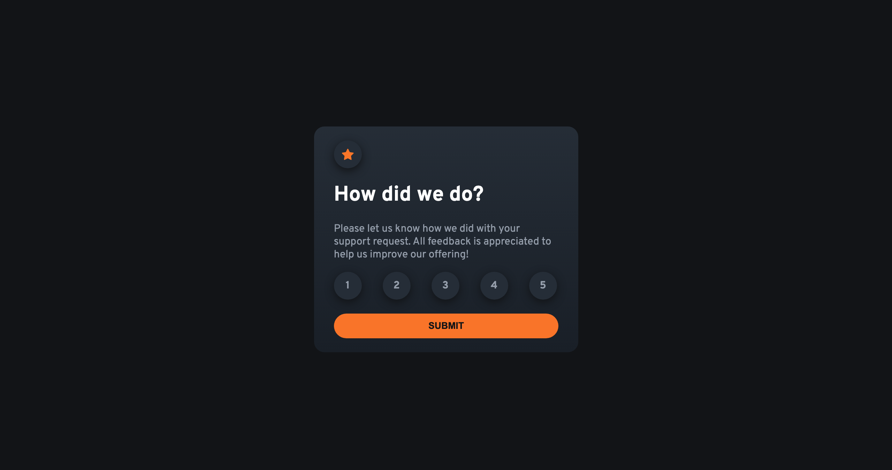

# Frontend Mentor - Interactive rating component

## Welcome! 👋

Thanks for checking out this Frontend Engineering project

[Frontend Mentor](https://www.frontendmentor.io) challenges help you improve your coding skills by building realistic projects.

## Table of contents

- [Overview](#overview)
  - [The project](#the-project)
  - [Screenshot](#screenshot)
  - [Links](#links)
- [My process](#my-process)
  - [Built with](#built-with)
  - [What I learned](#what-i-learned)
  - [Continued development](#continued-development)
  - [AI Collaboration](#ai-collaboration)
- [Author](#author)

## Overview

### The project

The project is the development of an interactive rating component that allows users to rate a business request support system from 1 through 5.

It allows users to:

- View the optimal layout for the app depending on their device's screen size
- See hover states for all interactive elements on the page
- Select and submit a number rating
- See the "Thank you" card state after submitting a rating

### Screenshot

### Links

- Solution URL: [Add solution URL here](https://github.com/Kingsleigh-Obi/interactive-rating-component-main.git)
- Live Site URL: [Add live site URL here](https://kingsleigh-obi.github.io/interactive-rating-component-main/thank-you.html)

## My Process

### Built With

- HTML
- CSS
- JavaScript

### What I learned

- I learnt about the local storage, and how it is used to make data persist
- I learnt how to use CSS gradient to render smooth color transistions
- I learnt how to break large problems into smaller chunks before tackling them
- I also improved my README file writing skills

### Continued development

 I aim to improve my understanding of more advanced JavaScript concepts such as: asynchronous programming, testing, arrow functions and also solve tougher problems.

 ### AI Collaboration

 - I used chat GPT to better understand concepts, such as addEventListener function, which I applied in this project

## Author

- LinkedIn - [Kingsley Obiagwu](linkedin.com/in/kingsley-obiagwu)
- Frontend Mentor - [Kingsleigh](https://www.frontendmentor.io/profile/Kingsleigh-Obi)

